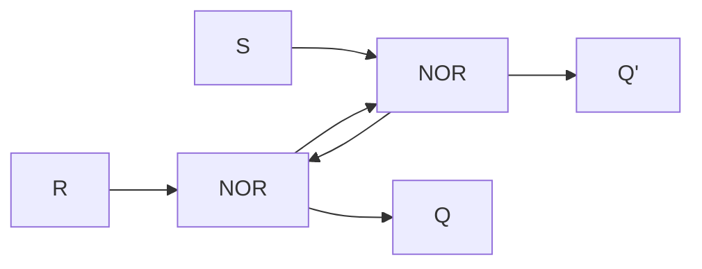
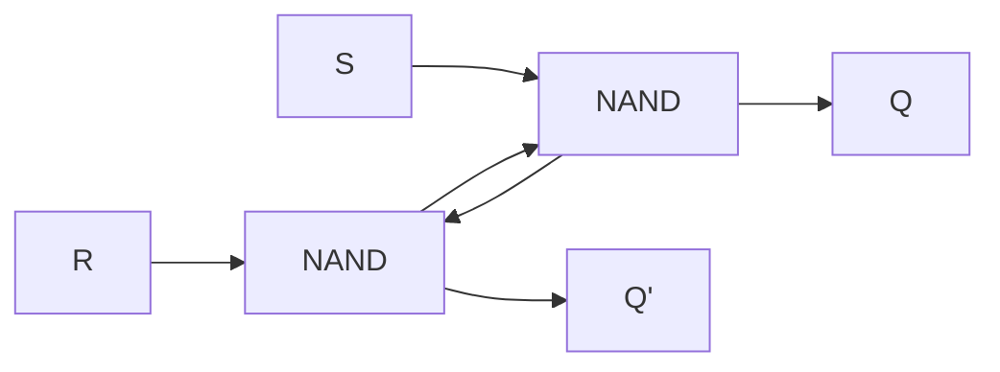

# Definition

A flip flop with two inputs, one is S and other is R.

# Notes

- An example of [[Sequential circuit]].
- One bit memory.
- Can be constructed with two NAND gates or two NOR gates.

With NOR gates:

```
S R Q Q'
0 0 1 0
0 0 0 1
0 1 0 1
1 0 1 0
1 1 0 0 # Invalid
```

With NAND gates:

```
S R Q Q'
0 0 1 1 # Invalid
0 1 1 0
1 0 0 1
1 1 0 1
1 1 1 0
```