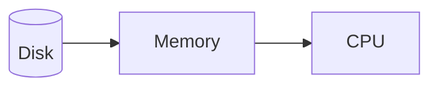
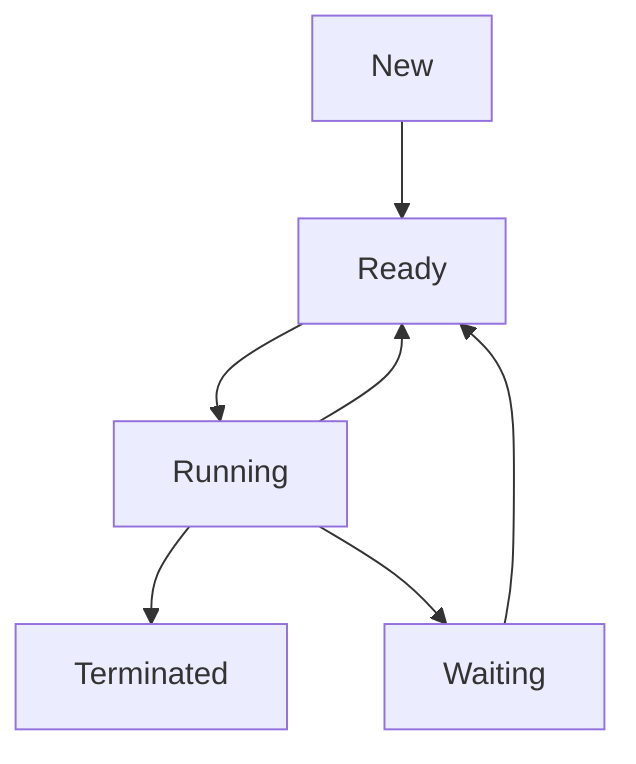

# Definition

A program in memory that has an associated [[Process control block|PCB]].

# Notes

Components involved in running a program:

```mermaid
flowchart LR
	A[(Disk)] --> Memory
	Memory --> CPU
```

Five states:

```mermaid
flowchart TB
	New --> Ready
	Waiting --> Ready
	Ready --> Running
	Running --> Ready
	Running --> Terminated
	Running --> Waiting
```