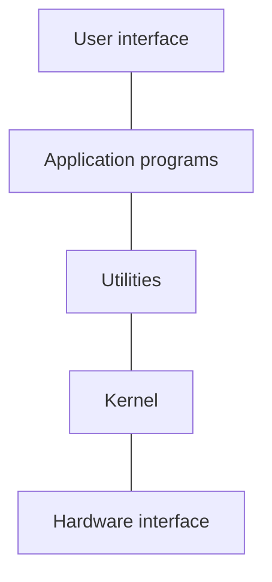
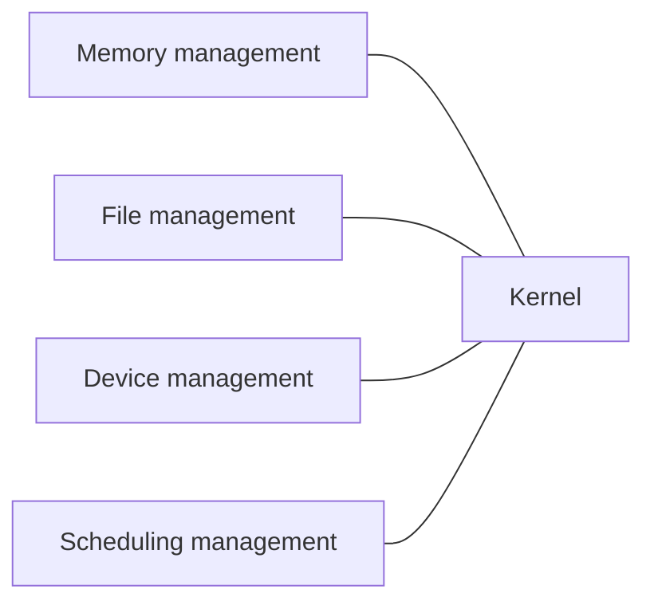

# Definition

# Notes

Layered structure:

```mermaid
flowchart TB
	A[User interface] --- B[Application programs]
	B --- C[Utilities]
	C --- D[Kernel]
	D --- E[Hardware interface]
```

Modular structure:

```mermaid
flowchart LR
	A[Memory management] --- Kernel
	B[File management] --- Kernel
	C[Device management] --- Kernel
	D[Scheduling management] --- Kernel
```